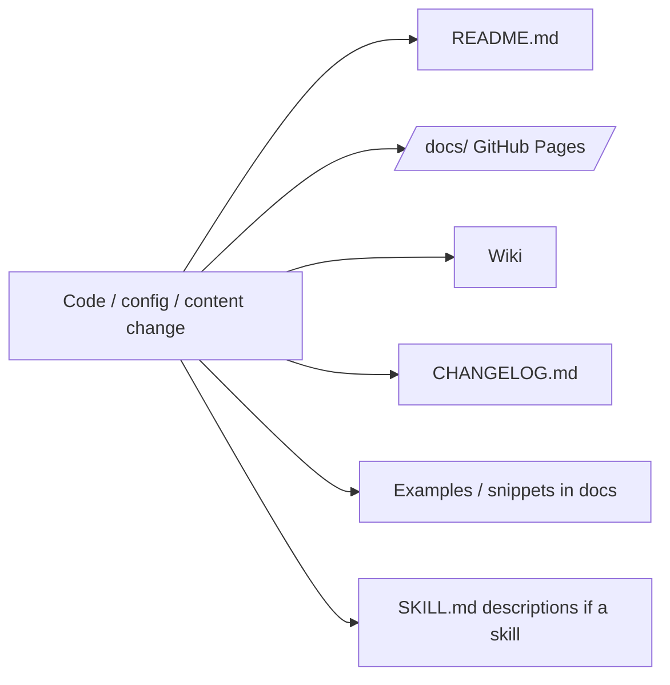
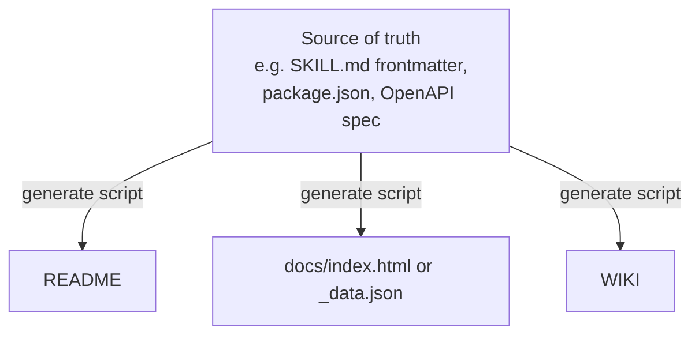

# Docs Sync On Change

**Rule:** documentation lives in the same commit as the code it documents. A PR that ships a feature without updating the docs is incomplete.

## Surfaces to check on every change



For each surface, ask: *does this change make any line here wrong, incomplete, or misleading?* If yes, update it in the same PR.

## Checklist (run before opening a PR)

1. **README.md** — feature list, install instructions, usage examples, table of contents.
2. **`/docs/` (GitHub Pages)** — if the repo has a `docs/` folder serving Pages:
   - Update the card grid / item list (`index.html` or `_data.json`).
   - Update version / last-updated timestamp.
   - Re-run any generator script (see "Single source of truth" below).
   - Open `docs/index.html` locally to verify rendering.
3. **CHANGELOG.md** — add an entry under `## [Unreleased]` (Keep a Changelog format).
4. **Wiki** (Azure DevOps or GitHub Wiki) — if the repo uses one and the change affects documented behavior.
5. **Inline examples** — code snippets in README/docs that import the changed symbol.
6. **`SKILL.md` description** (if this repo *is* a skills repo) — pushy descriptions must still match what the skill does.

## Single source of truth pattern

Avoid duplicating lists in multiple places. Pick one source and **generate** the others:



Examples:
- Skills repo → parse YAML frontmatter from each `*/SKILL.md` → emit README table + `docs/_data.json`.
- Library → parse `package.json` exports / TypeDoc → emit API reference page.
- Service → parse OpenAPI spec → emit endpoint list.

Put the generator under `scripts/build-docs.{sh,py,js}` and **run it in CI** to fail PRs that forgot to regenerate.

## CI guardrail (recommended)

Add a job that regenerates docs and fails if `git diff` is non-empty:

```yaml
# .github/workflows/docs-check.yml
name: docs-in-sync
on: [pull_request]
jobs:
  check:
    runs-on: ubuntu-latest
    steps:
      - uses: actions/checkout@v4
      - run: ./scripts/build-docs.sh
      - run: |
          if ! git diff --exit-code; then
            echo "::error::Docs are out of sync. Run scripts/build-docs.sh and commit."
            exit 1
          fi
```

## Anti-patterns

- **"I'll update the docs in a follow-up PR."** No. Same PR or it doesn't ship.
- **Hand-editing both `README.md` and `docs/index.html`** when one could generate the other — they will drift.
- **Forgetting `docs/` exists.** Always `ls docs/` (or check repo Settings → Pages) when starting a non-trivial change.
- **Updating docs but not the CHANGELOG** — release notes become guesswork later.
- **Letting the "last updated" date go stale** on the Pages site — a small JS one-liner reading `document.lastModified` or a build-time replacement avoids this.

## Quick prompt to self before commit

> "If a stranger reads only the README and the Pages site after this commit, will they get a correct picture of the repo? If not, what did I miss?"
