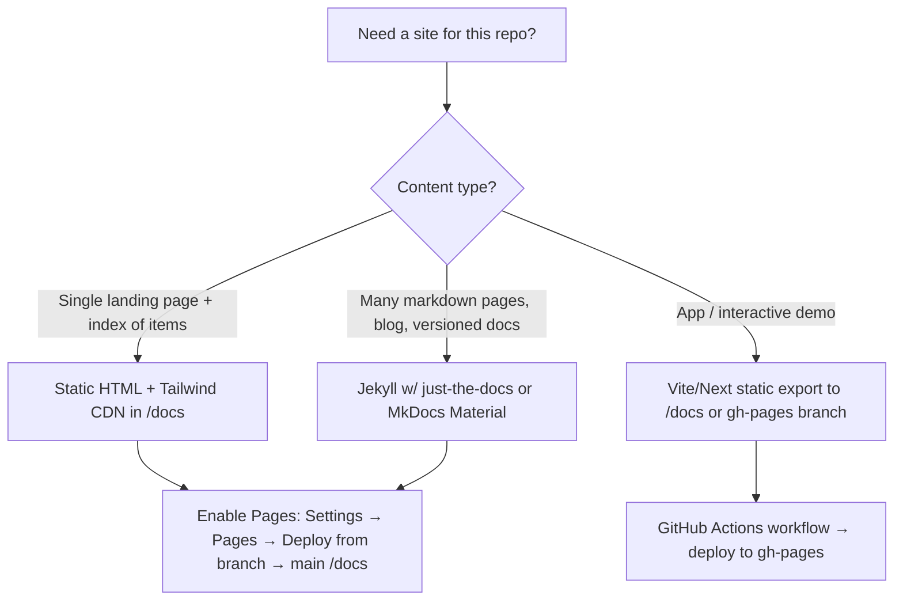

# GitHub Pages Generation

A repeatable recipe for shipping a polished GitHub Pages site without a heavy build pipeline.

## Decision tree



**Default choice: static HTML in `/docs`.** Zero build step, instant preview locally (`open docs/index.html`), no Ruby/Node toolchain, looks great with Tailwind CDN + Lucide icons.

## Standard layout (`/docs`)

```
docs/
  index.html          # landing page, hero + grid of items
  style.css           # optional overrides on top of Tailwind CDN
  assets/
    og-image.png      # 1200x630 social preview
    favicon.svg
  _data.json          # optional: source of truth for the item list (read by JS)
```

Keep the **item list as JSON or as a `<script type="application/json">` block** so the same data can be regenerated from `SKILL.md` frontmatter (or `package.json`, etc.) by a script — see the companion `docs-sync-on-change` skill.

## Required ingredients

1. **Hero section** — repo name, one-sentence purpose, primary CTA (GitHub link, install command).
2. **Card grid** — one card per item (skill / package / example) with title, scope/badge, 1-line description, link to source.
3. **"How to use" section** — copy-pasteable install / clone / load commands.
4. **Footer** — author, license, link back to repo, last-updated timestamp.
5. **`<meta>` tags** — `description`, `og:title`, `og:image`, `og:url`, `twitter:card`.
6. **Favicon** — even a 1-line SVG is fine.
7. **Mobile-responsive** — Tailwind handles this if you use `grid-cols-1 md:grid-cols-2 lg:grid-cols-3`.

## Tailwind CDN starter

Use the Play CDN (`https://cdn.tailwindcss.com`) for zero-build sites. For production-grade bundles, switch to the CLI build, but for a personal repo index the CDN is fine.

```html
<!doctype html>
<html lang="en" class="scroll-smooth">
<head>
  <meta charset="utf-8" />
  <meta name="viewport" content="width=device-width, initial-scale=1" />
  <title>{{ Repo Name }} — {{ Tagline }}</title>
  <meta name="description" content="{{ One-line description }}" />
  <meta property="og:title" content="{{ Repo Name }}" />
  <meta property="og:description" content="{{ One-line description }}" />
  <meta property="og:type" content="website" />
  <link rel="icon" href="assets/favicon.svg" type="image/svg+xml" />
  <script src="https://cdn.tailwindcss.com"></script>
  <link href="https://fonts.googleapis.com/css2?family=Inter:wght@400;500;600;700&display=swap" rel="stylesheet" />
  <style>body{font-family:'Inter',ui-sans-serif,system-ui,sans-serif}</style>
</head>
<body class="bg-slate-950 text-slate-100">
  <!-- hero, grid, footer -->
</body>
</html>
```

## Enabling Pages

1. Push `docs/` to `main` (or `master`).
2. GitHub repo → **Settings → Pages**.
3. Source: **Deploy from a branch**.
4. Branch: `main`, folder: `/docs`. Save.
5. Wait ~30s, then visit `https://<user-or-org>.github.io/<repo>/`.

For custom domain: add `docs/CNAME` containing the bare domain, configure DNS `CNAME` → `<user>.github.io`.

## Anti-patterns

- **Don't** dump a giant README into `index.html` — curate.
- **Don't** ship a Jekyll site if you only have one page — overkill.
- **Don't** hardcode the item list in HTML *and* in markdown — pick one source of truth and generate the other (see `docs-sync-on-change`).
- **Don't** forget `og:image` — it makes the link look professional when shared.
- **Don't** check in `node_modules/` or build artefacts; if you need a build step, deploy via GitHub Actions to the `gh-pages` branch instead.

## When to upgrade beyond static HTML

- Need search across many pages → MkDocs Material or Docusaurus.
- Need versioned docs → Docusaurus or `mike` (MkDocs).
- Need API reference auto-generated from code → TypeDoc / Sphinx / Doxygen.
- Need blog → Jekyll or Astro.

For everything else: **one `index.html`, one Tailwind CDN, ship it.**
