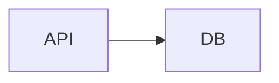
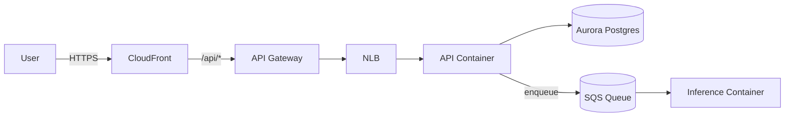
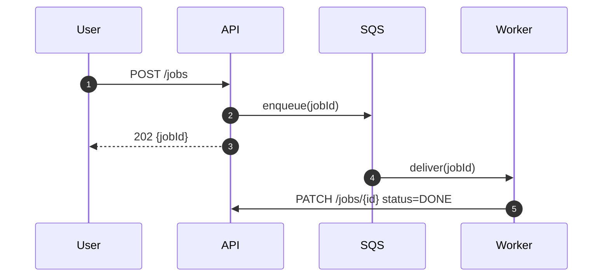
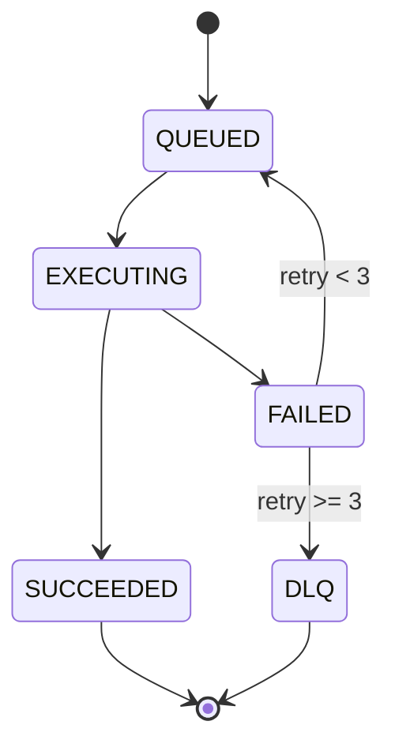
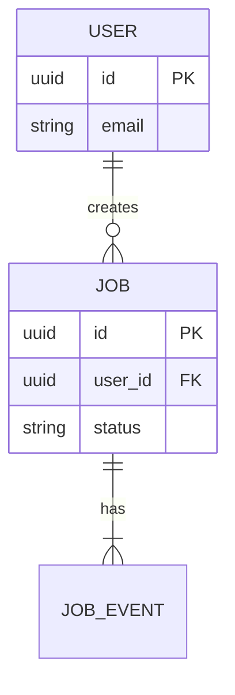
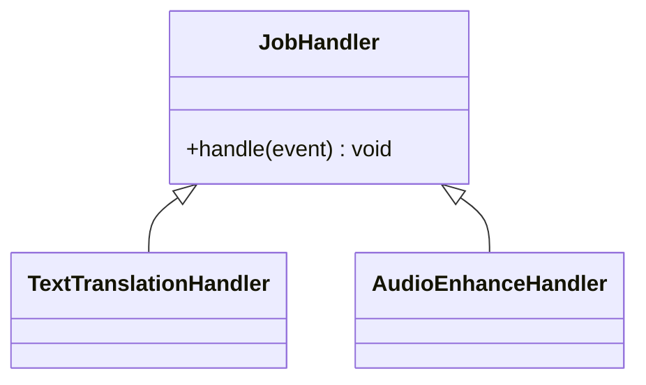
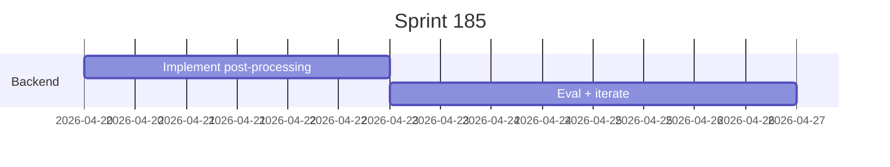
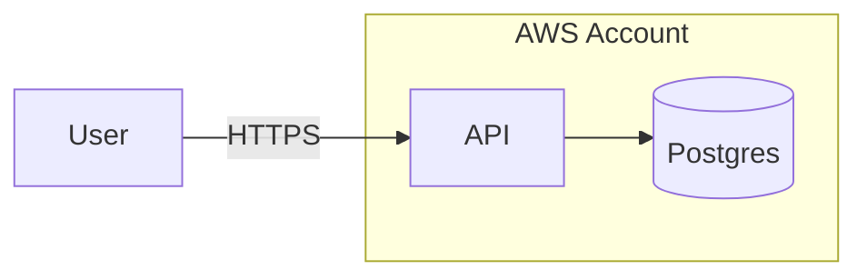

# Mermaid Diagrams (Not ASCII Art)

Markdown supports Mermaid natively on GitHub, Azure DevOps wikis, VS Code preview, and most modern viewers. **Always use Mermaid** for diagrams in markdown files. ASCII boxes-and-arrows are read-only, fragile to edit, accessibility-hostile, and don't render as images anywhere they matter.

## Rule

When you would otherwise draw something like:

```
+--------+      +--------+
|  API   | ---> |  DB    |
+--------+      +--------+
```

Write this instead:

````markdown

````

## Diagram Type Cheat-Sheet

Pick the diagram type that matches what you're showing. Don't force a `flowchart` for everything.

### Flowchart — components and data flow

````markdown

````

Directions: `LR` (left-right), `TB` (top-bottom). Most architecture diagrams read better in `LR`.

### Sequence — ordered interactions over time

````markdown

````

Use sequence when **order matters**. Add `autonumber` for traceability in long sequences.

### State — lifecycles

````markdown

````

### ER — data model

````markdown

````

### Class — type relationships

````markdown

````

### Gantt — timelines (use sparingly)

````markdown

````

## Style Discipline

- **One diagram, one idea.** Don't cram architecture, sequence, and state into one chart. Use multiple smaller diagrams.
- **Label edges** with the verb or the protocol — `-->|HTTPS|`, `-->|enqueue|`, `-->|writes|`. Unlabeled arrows are noise.
- **Use shape semantics**:
  - `[Rectangle]` — service / process
  - `[(Cylinder)]` — datastore / queue
  - `((Circle))` — actor / start
  - `{Diamond}` — decision
- **Subgraph** to show trust boundaries, VPCs, accounts:

````markdown

````

- Keep node names short. Put detail in labels, not in IDs.
- Prefer `flowchart` over the older `graph` keyword.

## Where to Use

- **READMEs** — show how the project hangs together at a glance
- **Specs** (`spec-before-code` skill) — Architecture and Threat Model sections
- **ADRs** — visualize the decision and its impact
- **PR descriptions** — when changing data flow, show before/after
- **Reports** (`research-and-report` skill) — when a sequence or state transition explains the result
- **Wikis / runbooks** — operational flows, on-call decision trees

## Where Mermaid Renders Out-of-the-Box

- GitHub markdown (issues, PRs, READMEs, wikis)
- Azure DevOps wikis and PR descriptions (recent versions)
- VS Code markdown preview (with extension or built-in on recent versions)
- Most static site generators (Docusaurus, MkDocs Material, GitBook)
- Notion (paste as code block with `mermaid` language)

If a renderer doesn't support Mermaid, that's a renderer problem, not a diagram problem. Don't fall back to ASCII; export the Mermaid to SVG/PNG and link it.

## Migration Recipe

When you encounter ASCII art in an existing markdown file:

1. Read what the diagram is trying to communicate.
2. Pick the correct Mermaid diagram type.
3. Replace the ASCII block with a `mermaid` fenced code block.
4. Keep the surrounding prose; only swap the diagram.
5. Render-check it (GitHub preview, VS Code preview) before committing.

## Anti-Patterns

- ASCII boxes-and-arrows in any new markdown file.
- One mega-flowchart trying to show every component, every call, and every state.
- Unlabeled arrows.
- Embedding screenshots of diagrams when the source could be Mermaid (loses editability).
- Mermaid for things Mermaid is bad at — pixel-perfect layouts, freeform sketches, photos. Use a real diagram tool (Excalidraw, draw.io) and embed the export.
